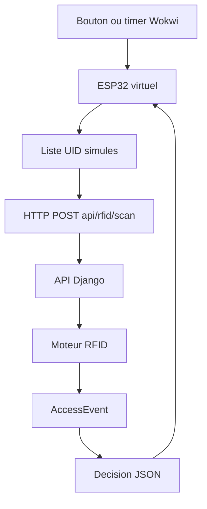

# Simulation ESP32 RFID avec Wokwi

Cette simulation sert a valider le flux embarque avant d'avoir une vraie carte RFID et un vrai lecteur. Le principe est de remplacer temporairement la lecture RFID physique par une liste d'UID simules, puis d'envoyer ces UID vers `POST /api/rfid/scan/`.

## Architecture



## Prerequis

- Backend Django lance avec `python manage.py runserver 0.0.0.0:8000`.
- Donnees demo chargees avec `python manage.py seed_demo`.
- Un token API valide. Le plus simple pour Wokwi est de recuperer le token une fois via login, puis de le coller dans le sketch.

## Acces reseau depuis Wokwi

Wokwi ne peut generalement pas appeler directement `http://127.0.0.1:8000` de votre PC.

Options recommandees :

- Utiliser un tunnel temporaire, par exemple ngrok ou Cloudflare Tunnel, vers `http://127.0.0.1:8000`.
- Deployer le backend sur une URL de test accessible publiquement.
- Si la simulation tourne dans le meme reseau local qu'un vrai ESP32, utiliser l'adresse LAN du PC, par exemple `http://192.168.1.20:8000/api/`.

## Sketch ESP32 simule

Ce sketch alterne entre trois cartes :

- `04A1B2C3` : carte demo autorisee.
- `04D4E5F6` : carte demo refusee pour frais impayes.
- `UNKNOWN001` : carte inconnue.

```cpp
#include <WiFi.h>
#include <HTTPClient.h>

const char* WIFI_SSID = "Wokwi-GUEST";
const char* WIFI_PASSWORD = "";

const char* API_BASE_URL = "https://votre-tunnel.example.com/api/";
const char* API_TOKEN = "COLLER_TOKEN_DRF_ICI";
const char* SOURCE = "esp32-wokwi-01";

const char* UIDS[] = {
  "04A1B2C3",
  "04D4E5F6",
  "UNKNOWN001"
};

int uidIndex = 0;
unsigned long scanCounter = 0;

void setup() {
  Serial.begin(115200);
  WiFi.begin(WIFI_SSID, WIFI_PASSWORD);

  Serial.print("Connexion WiFi");
  while (WiFi.status() != WL_CONNECTED) {
    delay(250);
    Serial.print(".");
  }
  Serial.println();
  Serial.println("WiFi connecte");
}

void loop() {
  const char* uid = UIDS[uidIndex];
  uidIndex = (uidIndex + 1) % 3;
  scanCounter++;

  sendScan(uid, scanCounter);
  delay(5000);
}

void sendScan(const char* uid, unsigned long counter) {
  if (WiFi.status() != WL_CONNECTED) {
    Serial.println("WiFi indisponible");
    return;
  }

  HTTPClient http;
  String url = String(API_BASE_URL) + "rfid/scan/";
  String requestId = String(SOURCE) + "-" + String(counter);
  String body = "{";
  body += "\"uid\":\"" + String(uid) + "\",";
  body += "\"source\":\"" + String(SOURCE) + "\",";
  body += "\"request_id\":\"" + requestId + "\"";
  body += "}";

  http.begin(url);
  http.addHeader("Content-Type", "application/json");
  http.addHeader("Authorization", "Token " + String(API_TOKEN));

  int status = http.POST(body);
  String response = http.getString();

  Serial.print("UID=");
  Serial.print(uid);
  Serial.print(" HTTP=");
  Serial.println(status);
  Serial.println(response);

  http.end();
}
```

## Validation attendue

- Carte `04A1B2C3` : `allowed=true`, `reason=none`.
- Carte `04D4E5F6` : `allowed=false`, `reason=unpaid_fees`.
- Carte `UNKNOWN001` : `allowed=false`, `reason=unknown_card`.
- Chaque scan doit creer un `AccessEvent` avec `source=esp32-wokwi-01`.

## Backup integration physique

Quand le materiel sera disponible, garder le meme endpoint et remplacer seulement la source de l'UID :

- ESP32 + MFRC522 via SPI.
- Ou ESP32 + PN532 via I2C/SPI.
- Lecture UID physique.
- Meme payload HTTP : `uid`, `source`, `request_id`.
- Meme logique serveur : aucune modification backend necessaire.

Pour eviter les doublons terrain :

- generer un `request_id` stable pour chaque lecture ;
- reutiliser le meme `request_id` pendant les retries ;
- garder une petite file locale si le reseau tombe ;
- afficher la decision serveur sur LED/buzzer/ecran.
